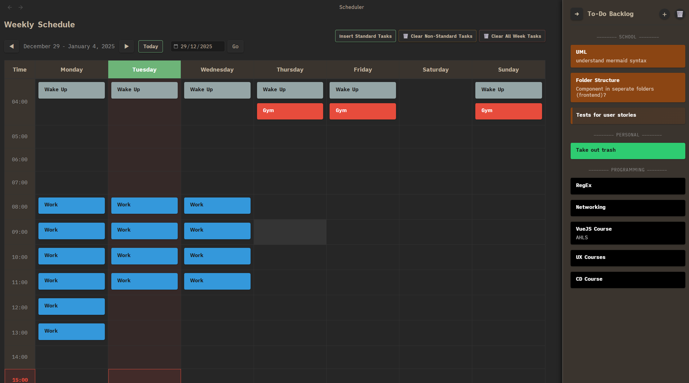
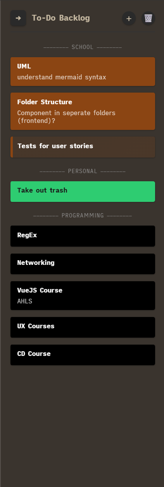
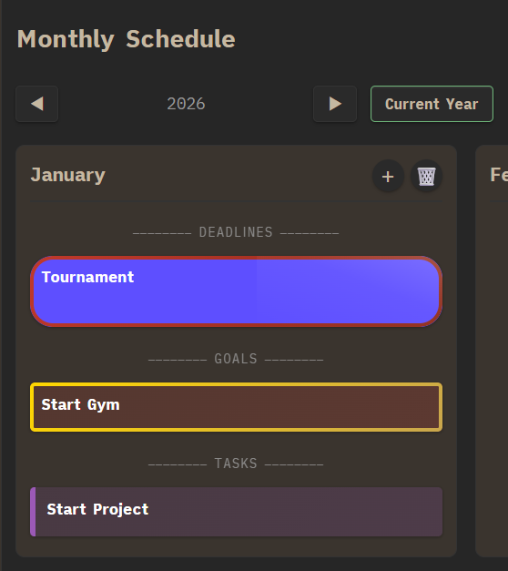
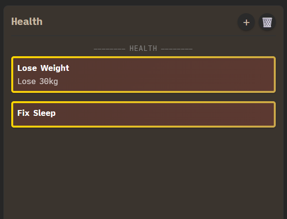

# Scheduler Plugin for Obsidian

An interactive weekly scheduler plugin with a dedicated view for managing your schedule, backlog, and goals.

## Screenshots

### Weekly Schedule View


### Backlog Sidebar


### Monthly Schedule View


### Goals Tracking


## Features

**Weekly Scheduler View**
- Dedicated scheduler interface accessible via sidebar
- Interactive weekly calendar (Monday-Sunday, 04:00-23:00)
- Click any cell to add/edit items
- Color-coded categories (School, Projects, Health, etc.)
- Multiple items per time slot
- Navigate between weeks and years

**Backlog Management**
- Track tasks that aren't scheduled yet
- Organize by categories
- Drag items to schedule them

**Goals Tracking**
- Set general goals
- Category-specific goals
- Track progress over time

**Standard Tasks**
- Pre-configure recurring items (Sleep, Gym, Meals, etc.)
- One-click populate for the current week
- Customize in settings

**Customizable Categories**
- Add, edit, or remove categories
- Set custom colors for each category
- Organize your schedule your way

## Installation

### From Obsidian Community Plugins (Coming Soon)

1. Open **Settings** in Obsidian
2. Navigate to **Community Plugins** and disable **Restricted Mode**
3. Click **Browse** and search for "Scheduler"
4. Click **Install**, then **Enable**

### Manual Installation

1. Download `main.js`, `manifest.json`, and `styles.css` from the [latest release](https://github.com/FarmaanFJM/obsidian-plugin-scheduler/releases)
2. Create a folder named `obsidian-plugin-scheduler` in your vault's `.obsidian/plugins/` directory
3. Copy the downloaded files into that folder
4. Reload Obsidian
5. Enable the plugin in **Settings → Community Plugins**

## Usage

### Opening the Scheduler

**Method 1: Ribbon Icon**
- Click the calendar icon in the left sidebar

**Method 2: Command Palette**
1. Open Command Palette (`Ctrl/Cmd + P`)
2. Run: **"Scheduler: Open Scheduler"**

### Adding Items to Your Schedule

1. In the scheduler view, **click any time cell**
2. A modal appears with:
   - **Name** (required): e.g., "Gym", "Study", "Meeting"
   - **Description** (optional): Additional details
   - **Category**: Choose from predefined categories
   - **Custom Color** (optional): Override category color
3. Click **"Add Item"**
4. The item appears in the cell with color formatting

### Navigating Weeks

- Use **◀ Previous Week** and **Next Week ▶** buttons
- View current week number and year at the top
- Schedule automatically saves for each week

### Using Standard Tasks

Standard tasks are recurring items you do regularly (like Sleep, Gym, Meals).

**To populate the current week with standard tasks:**
1. Open Command Palette (`Ctrl/Cmd + P`)
2. Run: **"Scheduler: Populate Standard Tasks"**
3. Your predefined standard tasks are added to the current week

**To configure standard tasks:**
1. Go to **Settings → Scheduler**
2. Scroll to **Standard Items**
3. Add/edit/remove recurring tasks
4. Set time slots and days for each task

### Managing Your Schedule

**Clear specific items:**
- Click on an item in a cell to edit or delete it

**Clear non-standard tasks:**
1. Command Palette → **"Scheduler: Clear All Non-Standard Tasks (Current Week)"**
2. Keeps standard/recurring tasks, removes everything else

**Clear ALL tasks:**
1. Command Palette → **"Scheduler: Clear ALL Tasks (Current Week)"**
2. Confirmation required
3. Removes all items including standard tasks

**Refresh the view:**
- Command Palette → **"Scheduler: Refresh Scheduler View"**
- Useful if view doesn't update automatically

### Using the Backlog

The backlog holds tasks that aren't scheduled yet:

1. Click **"+ Add to Backlog"** in the backlog sidebar
2. Add task details and category
3. Tasks are organized by category
4. When ready, schedule them by adding to a time slot

### Setting Goals

Track your objectives in the Goals section:

1. Navigate to the Goals view in the scheduler
2. Add general goals or category-specific goals
3. Check them off as you complete them

## Default Categories

- **School** - Brown (#8B4513)
- **Projects** - Purple (#563E78)
- **Health** - Orange (#FFA500)
- **Other** - Blue (#00A0C8)

## Commands Summary

| Command | Description |
|---------|-------------|
| Open Scheduler | Opens the scheduler view in a new tab |
| Populate Standard Tasks | Adds your predefined recurring tasks to the current week |
| Clear All Non-Standard Tasks (Current Week) | Removes all items except standard/recurring tasks |
| Clear ALL Tasks (Current Week) | Removes ALL items including standard tasks (requires confirmation) |
| Refresh Scheduler View | Manually refreshes the scheduler display |

## Settings

Access settings via **Settings → Scheduler**:

### Categories
- Add new categories
- Edit category names and colors
- Delete categories
- Reorder categories

### Standard Items
- Configure recurring tasks (Sleep, Gym, Meals, etc.)
- Set which days and times they occur
- Toggle whether they're active

### General Settings
- Start hour (default: 04:00)
- End hour (default: 23:00)
- Other display preferences

## Keyboard Shortcuts

- `Ctrl/Cmd + P` → Command Palette (to access all commands)
- Click cell → Add/edit items
- Click item → Edit or delete

## Data Storage

- All data is stored as JSON in your vault: `.obsidian/plugins/obsidian-plugin-scheduler/data.json`
- Schedule data is organized by year and week number
- Backlog and goals are stored separately
- Your data syncs with your vault (compatible with Obsidian Sync, iCloud, etc.)

## Development

Want to contribute or modify the plugin?

```bash
# Clone the repository
git clone https://github.com/FarmaanFJM/obsidian-plugin-scheduler.git

# Install dependencies
npm install

# Start development build (watch mode)
npm run dev

# Production build
npm run build
```

The plugin follows TypeScript best practices with organized file structure:
```
src/
├── managers/      # Business logic
├── modals/        # User interaction dialogs
├── settings/      # Plugin configuration
├── utils/         # Helper functions
└── views/         # UI rendering
```

## Technical Details

- Built with TypeScript
- Uses Obsidian Plugin API
- Custom view implementation
- Local-first (no external services)
- Works offline
- Compatible with mobile devices

## Support

For issues or feature requests, please visit the [GitHub repository](https://github.com/FarmaanFJM/obsidian-plugin-scheduler/issues).

## License

MIT

---

Enjoy organizing your schedule! 📅